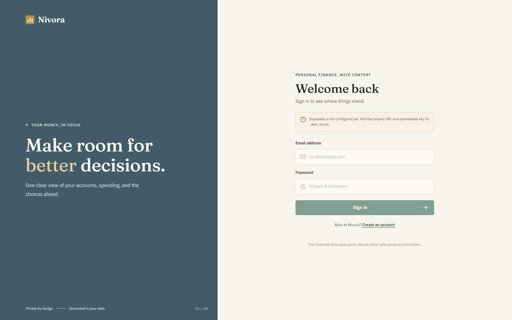

# Nivora

Nivora is an AI-augmented personal-finance workspace built around a clear account balance, a searchable ledger, inspectable spending insights, and an assistant that must look up account data before answering. It is designed as a portfolio capstone; it does not connect to banks or move money.



The screenshot shows the real sign-in surface. A live dashboard requires your own Supabase project and signed-in account; the repository contains no mock session or shared demo credentials.

## What it does

- Email/password sign-in and sign-up through Supabase Auth.
- Multi-account INR ledger for checking, savings, investment, and credit accounts.
- Dashboard balances and recent transactions read from Supabase Postgres.
- Searchable transaction explorer and account/transaction entry.
- OpenAI tool-calling assistant for transaction and category-spend questions, with visible source/date notes and fail-closed numeric evidence markers. Affordability checks bind the amount to the user's INR question and use a server-computed liquid-balance calculation.
- Supabase Realtime insert/update refresh for the signed-in user's ledger.
- Rule-based insights: category changes against a trailing average, unusually large purchases against a category median, and a month-end pace projection. These are statistical comparisons, not ML or “AI-powered” predictions.
- A lazy-loaded, keyboard- and pointer-rotatable React Three Fiber allocation view.

## Stack

Next.js 16 App Router, React 19, TypeScript, Supabase Auth/Postgres/Realtime, OpenAI Responses API, Zod, React Three Fiber, Three.js, and Vercel.

## Local setup

Use Node.js 20.12 or newer and npm.

1. Create a Supabase project. In its SQL Editor, run [`supabase/migrations/202609290001_initial_schema.sql`](supabase/migrations/202609290001_initial_schema.sql).
2. Copy `.env.example` to `.env.local` and enter your own values:

   ```dotenv
   NEXT_PUBLIC_SUPABASE_URL=https://<project-ref>.supabase.co
   NEXT_PUBLIC_SUPABASE_ANON_KEY=<publishable-or-anon-key>
   SUPABASE_SERVICE_ROLE_KEY=<service-role-key-for-local-seeding-only>
   OPENAI_API_KEY=<server-side-openai-key>
   OPENAI_MODEL=gpt-4.1-mini
   SEED_USER_EMAIL=<private-demo-user-email>
   SEED_USER_PASSWORD=<private-demo-user-password>
   ```

   Keep `.env.local` private. The service-role key bypasses RLS and must never use a `NEXT_PUBLIC_` name, be added to Vercel, or be committed.
3. Install and start the app:

   ```powershell
   npm install
   npm run dev
   ```

   Run `npm run visual:check` while the app is running to verify the sign-in layout at desktop and mobile widths and refresh the README screenshots.

4. For realistic portfolio data, run `npm run seed` from a trusted local machine with the service-role and seed-user values set. The idempotent script creates/confirms that user and seeds eight months of varied transactions across four accounts. Sign in with the private `SEED_USER_EMAIL` and `SEED_USER_PASSWORD` values. Do not publish those credentials.
5. In Supabase Auth URL Configuration, allow `http://localhost:3000/auth/callback` (and your eventual production callback URL).
6. Run `npm run verify:grounding` for keyless checks that invented amounts, invalid evidence IDs, incomplete results, and ambiguous affordability inputs fail closed.
7. To exercise the assistant against the seeded Supabase project and OpenAI, run `npm run verify:assistant`. It makes live tool-calling requests for category spend, a period comparison, and an affordability check. This requires the seed user's credentials, public Supabase URL/key, and an OpenAI API key in `.env.local`.

## Assistant architecture

See [`ARCHITECTURE.md`](ARCHITECTURE.md) for the end-to-end Responses API loop, evidence-marker validation, RLS boundaries, and Realtime refresh path. Amounts are stored and calculated in minor units. If a tool result is incomplete, an evidence ID is missing, the provider fails, or a generated answer contains an unverified number, Nivora returns a fixed unable-to-verify response rather than a guessed figure.

## Deployment

The app is Vercel-ready, but this repository has not been connected to a Vercel account or deployed yet. To deploy it:

1. Push/import this GitHub repository in Vercel and keep the framework preset as Next.js.
2. In **Project → Settings → Environment Variables**, add `NEXT_PUBLIC_SUPABASE_URL`, `NEXT_PUBLIC_SUPABASE_ANON_KEY`, and `OPENAI_API_KEY`. `OPENAI_MODEL` is optional; the default is `gpt-4.1-mini`. Apply them to the environments you intend to use, then redeploy.
3. Run the SQL migration in the production Supabase project. Add the production URL and `https://<your-domain>/auth/callback` under Supabase Auth URL Configuration.
4. If you want seeded portfolio data, run `npm run seed` locally against that Supabase project using its service-role key in the ignored `.env.local`. Keep the service-role key and seed-user password off Vercel and out of Git.

There is no live URL yet; one should be added here after the project is linked and deployed.

## Adversarial self-review

- Global and personal categories can reuse a slug. Slug-based aggregation could merge their spending or select the wrong category. Assistant filters and insight grouping now use category UUIDs; evidence-marker failure cases have keyless regression checks.
- A model could cite a real balance while changing the requested expense or treating investments as spendable. Affordability forces the balance tool, binds it to the amount in the question, excludes investments, and returns a server-computed comparison of checking/savings less recorded credit. The response warns that upcoming bills are not known.
- PostgREST's default page size could silently undercount dashboard month totals, while capped insight history could produce misleading comparisons. Month totals now use an RLS-scoped SQL aggregate; insights stop and show a limit state instead of calculating from partial history.
- Future-dated ledger entries would immediately change today's balance, so the transaction API rejects them.
- RLS policies alone do not grant SQL privileges. The migration now grants only the required authenticated operations and gives the seeder its explicit service-role privileges. The auth callback also rejects off-site return URLs.
